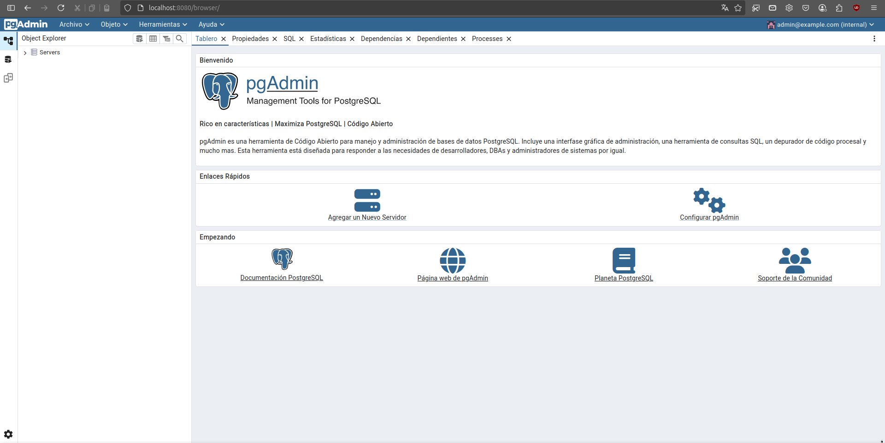
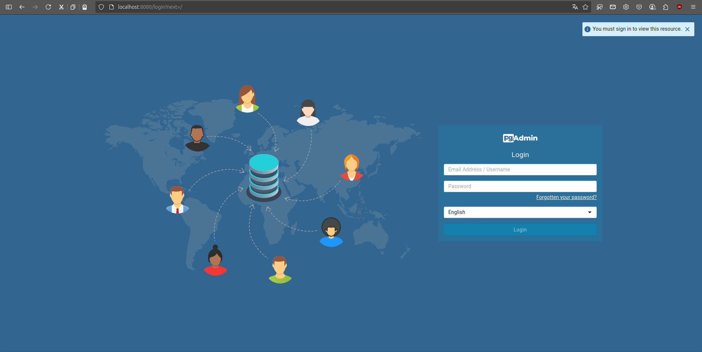

# MORPHOKEY
MORPHOKEY es una aplicación en desarrollo orientada a la identificación taxonómica de animales mediante la implementación de claves taxonómicas sistemáticas. El sistema integra múltiples tipos de claves (dicotómicas, multientradas, visuales y morfológicas) para optimizar procesos de clasificación basados en caracteres anatómicos y fenotípicos. Está diseñada para soportar estructuras jerárquicas taxonómicas complejas, facilitando la automatización del análisis y la interoperabilidad con sistemas de biodiversidad y bases de datos biológicas.

## Estructura del proyecto
1. **morphoKey-database**
    directorio en el cual se almacenan todos los scripts relacionados con la construcción con la base de datos, consultas, funciones, entre otras.
    [morphoKey-database](https://github.com/Luis-For/MorphoKey-ui-backend/tree/main/morphoKey-database)
2. **app/demo**
    Directorio donde estara el codigo Backend construido en JAVA con SpringBoot
   [app/demo](https://github.com/Luis-For/MorphoKey-ui-backend/tree/main/app/demo)
3. **docs**
    Directorio donde estara toda la documentación extra del proyecto
    [docs](https://github.com/Luis-For/MorphoKey-ui-backend/tree/main/docs)

## Configuración del proyecto con docker
Este proyecto utiliza **Docker** y **Docker-compose** para gestionar servicios y sus bases de datos.

## Requisitos
Se debe tener instalado en tu sistema lo siguiente:

### 1. Git

- **Windows**  
  Descarga desde: [https://git-scm.com/download/win](https://git-scm.com/download/win)

- **Linux (Debian/Ubuntu)**  
  ```bash
  sudo apt update
  sudo apt install git``` 

### 2. Docker
- **Windows:**
Descarga Docker Desktop desde:[https://www.docker.com/products/docker-desktop](https://www.docker.com/products/docker-desktop)

- **Linux (Debian/Ubuntu):**
Instrucciones oficiales: [https://docs.docker.com/engine/install/ubuntu/](https://docs.docker.com/engine/install/ubuntu/)

## Ejecutar el Proyecto
1. Acceder al directorio donde esta el proyecto y el docker-compose y ejecutar el comando:
```bash 
    cd MorphoKey-ui-backend 
    docker-compose up -d
```
usando la url [localhost://8080](localhost://8080)


